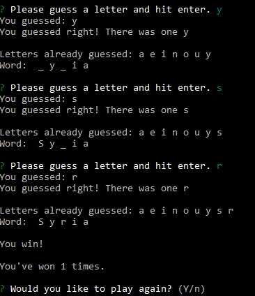
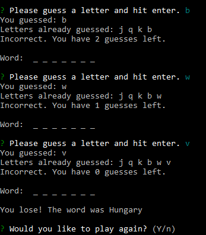

Enjoy my command line hangman game made with node.js and inquirer!
# Hangman: Geographic Edition
Welcome to my command line geography hangman, made using node.js and inquirer.  Once a user starts the program a random country is selected.  The countries letters are changed into blanks and the player can guess letters by pressing the letter on a keyboard.   
  
 